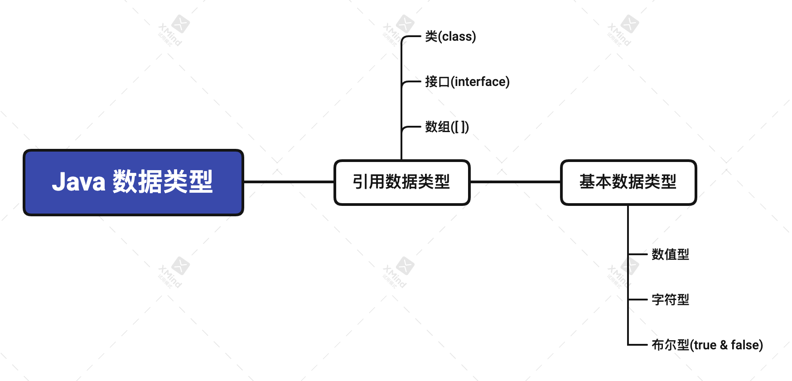

# 前言

关于Java学习，更新自己在前端学习过程中的笔记与总结。坚持学习，不断进步。

#### 变量
| shortcode | Description | 
| :-: | - | 
| int | 整数型 | 
| double | 小数型 |
| char | 字符型 |
| String | 字符串型 |

```markdown
public class Var01 {

    //code an method with main
    public static void main(String[] args){
        //record the information of a man
        int age = 30;
        double score = 88.9;
        char gender = '男';
        String name = "Charles";
        //output information
        System.out.println("The informaiton of the man is below:");
        System.out.println(name);
        System.out.println(gender);
        System.out.println(score);
        System.out.println(age);
    }
}

```
#### 加号的使用
当加号两边是数值型，则为加法
若两边为字符型，则为拼接
加法由左至右

#### 数据结构

